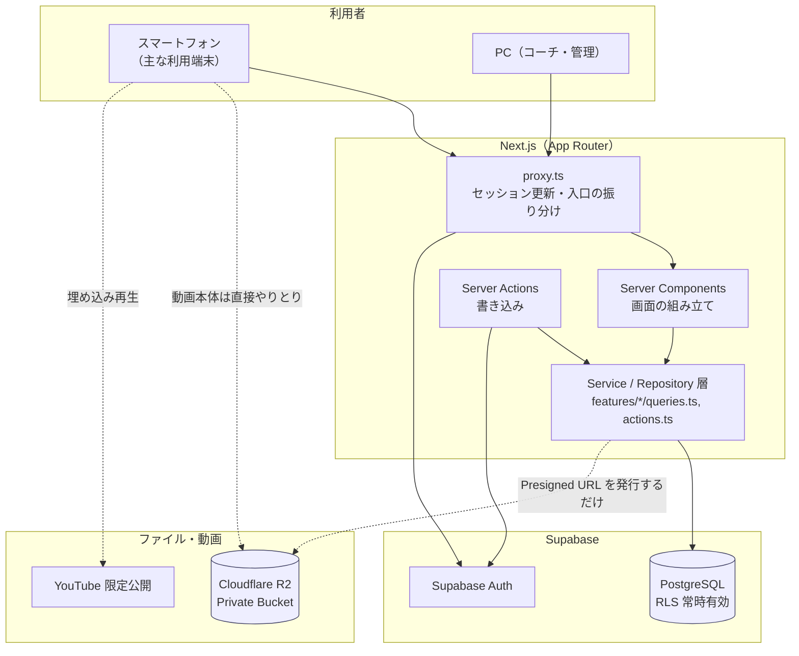
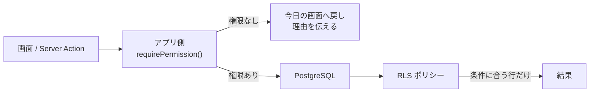
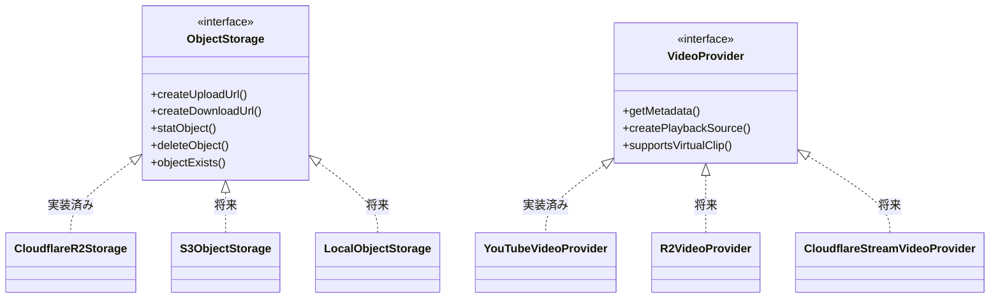

# アーキテクチャ

## 1. 全体構成

大きなファイルを Postgres に入れない、特定サービスに寄りかかりすぎない、
という2点を軸にしています。



**要点**

- 動画本体はアプリサーバーを通さない。ブラウザと R2 が直接やりとりする（20章）
- アプリが R2 に対してすることは「期限付きの URL を発行する」ことだけ
- 長時間動画は YouTube に置き、アプリは ID と再生範囲しか持たない

## 2. インフラの役割分担

| 置き場所         | 何を置くか                                 | 置かないもの               |
| ---------------- | ------------------------------------------ | -------------------------- |
| PostgreSQL       | 人・予定・記録・状態・メタデータ・監査ログ | ファイル本体、署名付きURL  |
| Cloudflare R2    | 短編動画、画像、PDF、サムネイル            | 恒久公開のファイル         |
| YouTube 限定公開 | 練習・試合の全体動画、長時間の分析動画     | 個人が特定される非公開情報 |

## 3. レイヤー構成

業務ロジックを画面に書かない、という一点を守るための分け方です。

```
src/
├─ app/                     画面（ルーティング）。データの取得と表示だけ。
│  ├─ (auth)/               ログイン前
│  ├─ (app)/                ログイン後（下部ナビゲーション付き）
│  └─ proxy.ts の対象外は静的ファイルのみ
│
├─ features/<領域>/
│  ├─ queries.ts            読み取り（server-only）
│  ├─ actions.ts            書き込み（'use server'）
│  ├─ schemas.ts            Zod による入力検証
│  ├─ lib/                  純粋な業務ロジック（テストで守る）
│  └─ components/           その領域だけで使う UI
│
├─ lib/
│  ├─ auth/                 セッションと権限判定
│  ├─ supabase/             クライアントの生成
│  ├─ storage/              ObjectStorage 抽象と R2 実装
│  ├─ video/                VideoProvider 抽象と YouTube 実装
│  ├─ datetime.ts           UTC 保存 / Asia/Tokyo 表示
│  └─ labels.ts             画面に出す日本語
│
├─ components/ui/           どこでも使う小さな部品
└─ types/database.types.ts  DB の型
```

### なぜ `lib/` に純粋なロジックを置くか

`features/*/lib/` に入っているのは、DB もネットワークも触らない関数だけです。

- `import/lib/normalize.ts` — 「3年生」→ 3、「フォワード」→ FW
- `import/lib/matching.ts` — 同姓同名をどう扱うか
- `dashboard/lib/pending-actions.ts` — 今日まだ終わっていないこと
- `storage/validation.ts` — 受け入れてよいアップロードか

ここが最も壊れやすく、壊れた時の影響が大きい部分です。
だから外部依存を持たせず、単体テストで固めています。

## 4. 権限は二重に守る



RLS だけでも安全ですが、それだけだと「0件が返る」だけで
利用者には理由が分かりません。逆にアプリ側だけでは、
URL の直打ちや将来の実装漏れを防げません。だから両方で守ります。

判定の規則は2か所にあります。**変えるときは必ず両方を直してください。**

- SQL: `app.has_permission()`（`supabase/migrations/0002_auth_helpers.sql`）
- TypeScript: `hasPermission()`（`src/lib/auth/permissions.ts`）

## 5. 抽象化しているところ

特定サービスへの依存を薄くするため、2か所だけ interface を挟んでいます。



逆に、**Supabase は抽象化していません**。
認証と RLS はデータベースと不可分で、間に層を挟むと
かえって RLS の効き方が見えなくなるためです（[ADR-0001](decisions/0001-tech-stack.md)）。

## 6. 時刻の扱い

- 保存は UTC（`timestamptz`）
- 表示は Asia/Tokyo
- 「日付だけ」の列（`date`）は文字列 `YYYY-MM-DD` のまま扱う

`date` 型を JavaScript の `Date` に通すと、実行環境のタイムゾーン次第で
1日ずれます。`src/lib/datetime.ts` はそれを避けるために用意しています。

## 7. Next.js 16 で気をつけること

このプロジェクトは Next.js 16 を使っています。以前の版と違う点があります。

- `middleware.ts` は **`proxy.ts`** に変わりました
- `params` / `searchParams` / `cookies()` / `headers()` は **すべて非同期**です
- Turbopack が既定です

書く前に `node_modules/next/dist/docs/` の該当箇所を確認してください。
