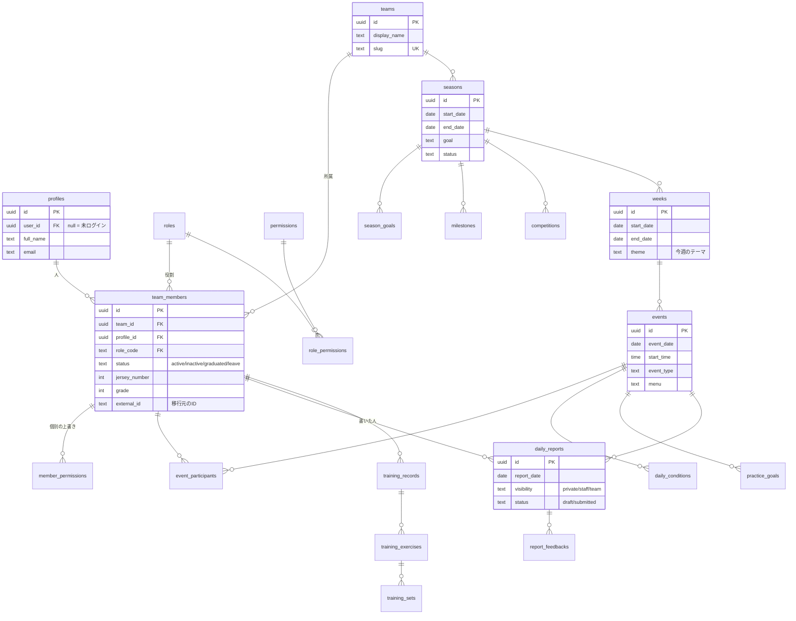
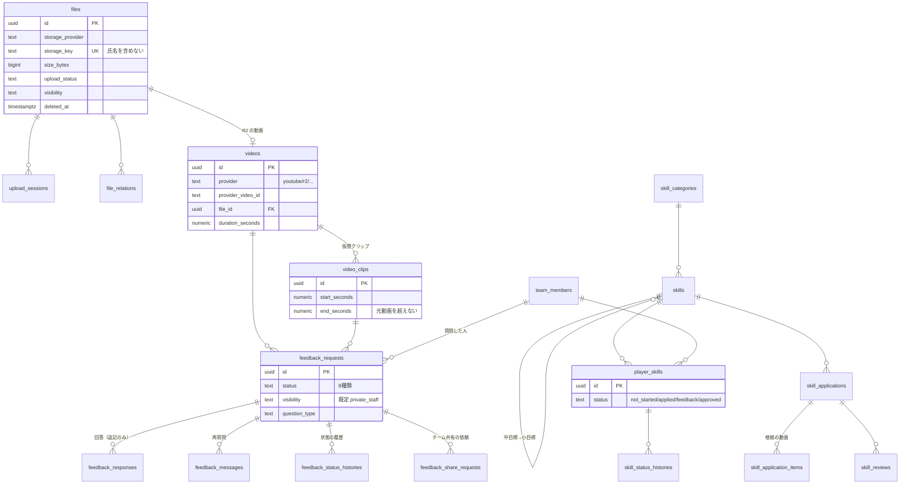
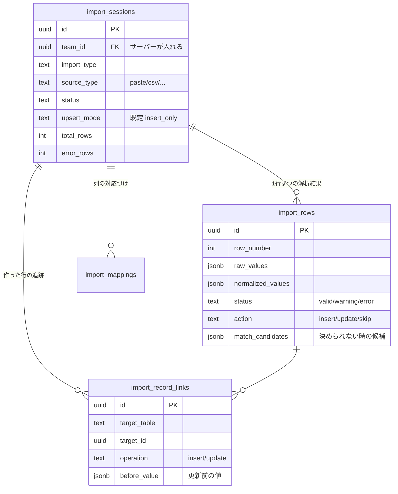

# データベース

## 1. 中心にある形

```
シーズン
└── 週
    └── イベント（練習・試合）
        ├── 練習前（コンディション・個人目標）
        ├── 練習中
        ├── 練習直後（日報）
        └── 帰宅後（トレーニング記録・動画質問）
```

この形が崩れると、他の機能もつながらなくなります。
`seasons` → `weeks` → `events` は最初に作り、後から変えにくい部分です。

## 2. ER図（中心部分）



## 3. ER図（動画・フィードバック・スキル）



## 4. ER図（データ移行）



`import_record_links` があるおかげで「この取り込みを取り消す」ができます。

## 5. 決めごと

### 5.1 削除は論理削除

ほとんどのテーブルに `deleted_at` があります。
選手の記録は本人の成長の記録なので、簡単に消えてはいけません。

- 卒業・退部は `team_members.status` を変えるだけ。記録はそのまま残す（61章）
- 利用者の削除と過去記録の削除を直接つなげない

### 5.2 profiles と auth.users を分けている

`profiles.id` は `auth.users.id` と一致しません。
`profiles.user_id` が `auth.users` を指し、**null を許します**。

移行で登録した選手は、まだログインしていない状態から始まるためです。
詳しくは [ADR-0002](decisions/0002-profile-identity.md)。

### 5.3 team_id をほぼ全テーブルに持たせている

正規化だけを考えれば不要な列ですが、RLS のためにあえて持たせています。
毎回 join を辿らないと所属チームが分からないと、
ポリシーが複雑になり、複雑なポリシーは間違えます。

### 5.4 値の種類は enum ではなく CHECK 制約

Postgres の enum は後から値を足すのが面倒です。
状態の種類は今後増えると分かっているので、`text` + `CHECK` にしています。

TypeScript 側の型（`src/types/database.types.ts`）と対応させています。

### 5.5 状態の変更は履歴を残す

`feedback_status_histories` と `skill_status_histories` に、
誰がいつどの状態からどの状態へ変えたかを残します。
フィードバックについては**トリガで自動的に**記録されるので、
書き忘れが起きません。

## 6. DB 側で守っていること

アプリを直さなくても壊れないよう、データベース自身に守らせています。

| 守ること                             | どこで                               |
| ------------------------------------ | ------------------------------------ |
| クリップが元動画の長さを超えない     | `app.validate_video_clip()` トリガ   |
| フィードバックの不正な状態遷移を禁止 | `app.guard_feedback_status()` トリガ |
| 在籍中の背番号が重複しない           | 部分ユニークインデックス             |
| 週の開始日が重複しない               | 部分ユニークインデックス             |
| シーズン・週の終了日が開始日以降     | CHECK 制約                           |
| メールが（あれば）一意               | 部分ユニークインデックス             |

これらは `supabase/tests/constraints_test.sql` で確認しています。

```bash
pnpm db:test
```

## 7. マイグレーションの方針

- 番号順に、前に進むだけ。既存のファイルは書き換えない
- 破壊的な変更は「新しい列を足す → 移行する → 古い列を消す」の3手に分ける
- `0009_master_data.sql`（ロールと権限）は**アプリの動作に必須**なので seed ではなく migration に置いている
