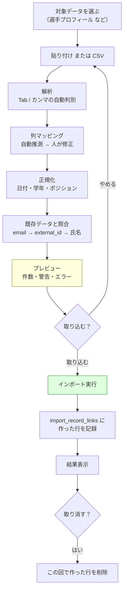
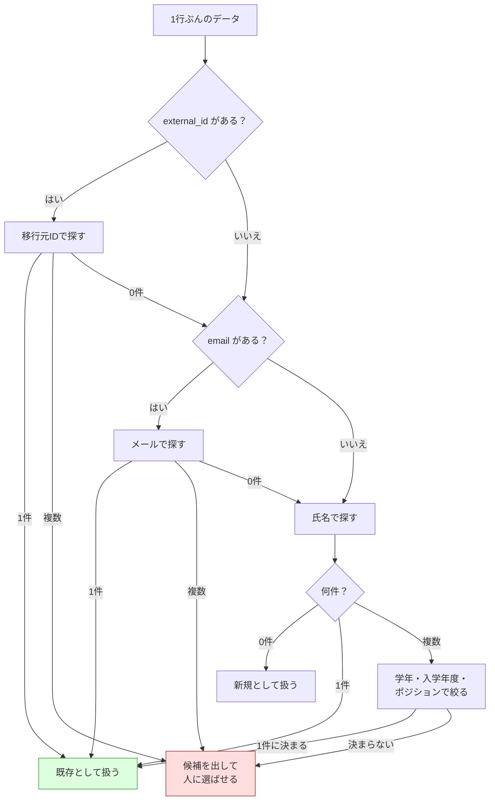
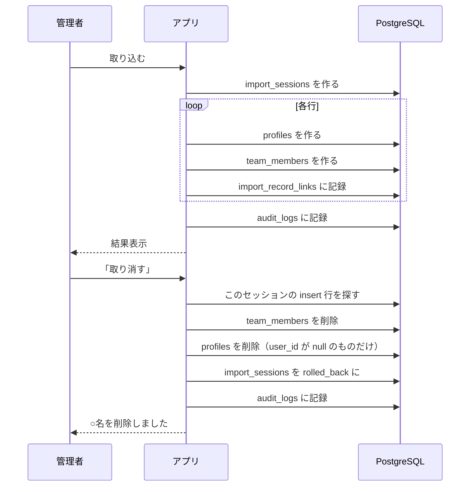

# Import Center（データ移行）

## 1. 目的

過去の Google スプレッドシート資産を失わずに、新システムへ移すこと。

目標とする操作は次のこれだけです（49章）。

```
Google Sheets を選択 → コピー → 貼り付け → プレビュー → 確認 → 移行
```

Google Sheets API との直接同期は MVP では作りません。
代わりに「コピペ」「CSV」「テンプレートCSV」の3つを用意します。

## 2. 全体の流れ



**プレビューが終わるまで、本体のテーブルは1行も書き換えません（39章）。**

## 3. 貼り付けの解析

Google スプレッドシートで範囲選択してコピーすると、Tab 区切りで渡ってきます。

```
氏名	学年	ポジション	背番号
山田花子	3	MF	10
鈴木花	2	FW	9
```

- 1行目を見出しとして扱う
- Tab とカンマを自動で見分ける
- CSV は RFC 4180 に沿って解析する（引用符の中のカンマ・改行を保つ）
- UTF-8 BOM を取り除く（Excel が書き出した CSV に付いている）
- CRLF と LF のどちらでも読める
- 末尾の空行は捨てる
- 列数が見出しと違う行は、捨てずに警告する

上限は `MAX_IMPORT_FILE_SIZE_BYTES`（既定 10MB）と
`MAX_IMPORT_ROWS`（既定 10,000行）です。

## 4. 列マッピング（40章）

列名に完全一致を求めません。

| 元の見出しの例                              | 取り込み先       |
| ------------------------------------------- | ---------------- |
| 名前 / 氏名 / 選手名 / Player / player_name | `full_name`      |
| ふりがな / フリガナ / よみ / kana           | `furigana`       |
| メールアドレス / メール / mail / email      | `email`          |
| 学年 / 年次 / 回生 / grade / year           | `grade`          |
| 入学年度 / 入部年度 / admission_year        | `admission_year` |
| ポジション / ポジ / position / pos          | `position`       |
| 背番号 / 番号 / number / no / #             | `jersey_number`  |
| 個人目標 / 目標 / goal                      | `personal_goal`  |
| ID / 旧ID / 管理番号                        | `external_id`    |

比較の前に、全角・空白・記号・大文字小文字の違いを消しています。
`背 番 号` と `背番号`、`E-mail` と `email` は同じものとして扱われます。

**完全一致を部分一致より優先します。**
`選手氏名` と `氏名` が並んでいたら、`氏名` のほうが `full_name` になります。

自動推測の結果は画面で必ず直せます。分からない列は空欄（取り込まない）にします。
勝手に当てはめません。

## 5. 正規化（41章）

**吸収はする。しかし推測しすぎない。**

### 日付

| 入力                                                        | 結果                     |
| ----------------------------------------------------------- | ------------------------ |
| `2026/4/15` `2026-04-15` `2026年4月15日` `２０２６/４/１５` | `2026-04-15`             |
| `4/15`（基準年あり）                                        | `2026-04-15` ＋ **警告** |
| `4/15`（基準年なし）                                        | エラー                   |
| `2026-02-30`                                                | エラー（存在しない日）   |
| `来週の火曜`                                                | エラー                   |

### 学年

`3` `3年` `3年生` `３年` → `3`　／　範囲外（0や9）はエラー

### ポジション

| 入力                                    | 結果                         |
| --------------------------------------- | ---------------------------- |
| `Forward` `フォワード` `FW` `fw`        | `FW`                         |
| `Midfielder` `ミッド` `ハーフ` `MF`     | `MF`                         |
| `goalkeeper` `キーパー` `GK`            | `GK`                         |
| `defender` `ディフェンス` `バック` `DF` | `DF`                         |
| `センター`                              | **エラー**（勝手に決めない） |

### 学年と入学年度の食い違い

どちらが正しいか機械には決められないので、**直さずに警告します**。

> 学年（1年）と入学年度（2024）が合いません。入学年度からは 3 年になります。

## 6. 選手照合（42章）

同じ選手を二重に作らないための仕組みです。



一意に決められない場合は**エラーにして候補を見せます**。

```
田中花子 は2人います。どちらか選んでください。
  ・田中花子 / 4年 / MF / tanaka@example.com
  ・田中花子 / 1年 / FW
```

補助情報で絞るときは、**入力側に無い項目は判断材料にしません**。
学年が空欄だからといって「学年が一致しない」とは扱いません。

## 7. 既存データの扱い（46章）

3つから選べます。**既定は安全側**です。

| 設定                  | 既存と重なった行                               |
| --------------------- | ---------------------------------------------- |
| `insert_only`（既定） | 取り込まない。「既に登録されています」と伝える |
| `update_existing`     | 上書きする                                     |
| `skip_existing`       | 黙って飛ばす                                   |

**既定では既存データを絶対に上書きしません。**
同じデータを2回貼り付けても、二重登録も上書きも起きません。

## 8. エラーの扱い（45章）

**1行のエラーで全体を止めません。**

```
総件数：235
正常：219
警告：13
エラー：3

新規：30
更新：202
スキップ：3
```

エラー行だけを除いて取り込めます。
行ごとに「何行目の、どの項目が、なぜだめか」を出します。

> 5行目 ポジション: ポジションとして読み取れません（センター）。
> GK / DF / MF / FW / STAFF のいずれかにしてください。

## 9. 取り消し（48章）

取り込みで**新規作成した行**を `import_record_links` に記録しています。



**既にログインした人（`user_id` がある人）は取り消しでも消しません。**
移行後に本人が使い始めている可能性があるためです。

更新した行は、変更前の値を `before_value` に残しています。
自動では戻しません（その後の編集を壊す恐れがあるため）。

## 10. セキュリティ（50章）

- 実行できるのは `import.execute` を持つ人だけ。RLS でも同じ条件で守っている
- **CSV の中に `team_id` があっても使いません。** サーバーがログイン中のチームを入れます
- 取り込みと取り消しは監査ログに残ります

### なぜ管理用クライアントを使うのか

`profiles` には `team_id` がありません。人はチームより先に存在するからです。
そのため RLS で「このチームの管理者だけが profiles を作れる」と書けません。

そこで取り込みの書き込みだけは service role を使い、代わりに次を守っています。

1. 事前に `requirePermission('import.execute')` を通す
2. `team_id` は必ずログイン中の値を入れる
3. 監査ログに残す

詳しくは [ADR-0003](decisions/0003-import-write-path.md)。

## 11. 対応している取り込み

| 対象                                   | 状態                      |
| -------------------------------------- | ------------------------- |
| 選手プロフィール                       | ✅ 実装済み               |
| シーズン / 週 / 練習予定 / 週間テーマ  | ⬜ テーブルと型は用意済み |
| 日報 / トレーニング記録                | ⬜ 同上                   |
| スキル進捗 / スキル申請履歴 / 測定結果 | ⬜ 同上                   |

`import_sessions.import_type` には既にすべての種別が入っています。
新しい対象を足すときは、`features/import/lib/` に
その対象向けの正規化と照合を足す形になります。

## 12. CSV テンプレート（38章）

```csv
# 選手
氏名,メールアドレス,学年,入学年度,ポジション,背番号

# 日報
日付,選手名,イベント名,個人目標,できたこと,できなかったこと,原因,次回課題

# スキル進捗
選手名,大分類,中目標,小目標,ステータス,承認日

# 測定結果
測定日,選手名,測定項目,結果,単位
```

## 13. テスト

移行は「一度きりだが失敗できない」操作なので、厚くテストしています。

| ファイル                | 何を確かめているか                                                   |
| ----------------------- | -------------------------------------------------------------------- |
| `parse.test.ts`         | 貼り付け、CSV、BOM、CRLF、引用符、列数の不揃い、行数上限             |
| `normalize.test.ts`     | 日付・学年・ポジション・背番号・メールの正規化と、推測しすぎないこと |
| `mapping.test.ts`       | 表記ゆれの自動対応づけ、完全一致の優先、二重割り当ての検出           |
| `matching.test.ts`      | external_id / email / 氏名の優先順位、同姓同名の扱い                 |
| `player-import.test.ts` | 全体の流れ、エラー行の分離、上書き防止、集計                         |
