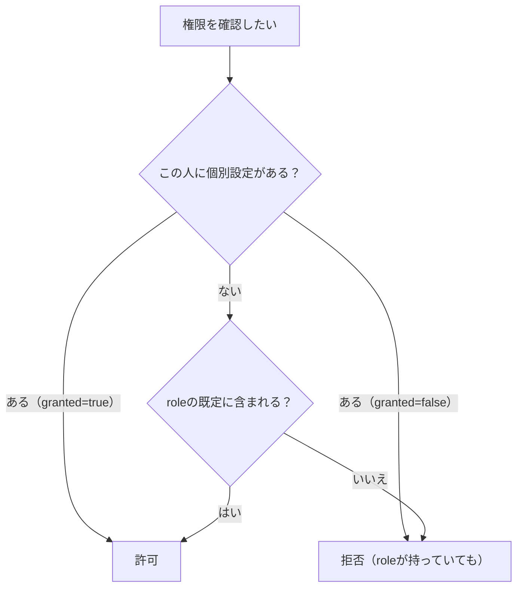

# ロールと権限

## 1. 考え方

役割（role）だけで権限を決めると、必ず例外が出ます。

> 「このコーチにだけデータ移行を任せたい」
> 「このマネージャーには日報を見せたくない」

そのたびに新しい role を作ると、role が増えて誰も把握できなくなります。
そこで **role は既定値、個別設定が上書き** という形にしています。



## 2. 役割

| コード         | 表示         | 想定                                 |
| -------------- | ------------ | ------------------------------------ |
| `system_admin` | 管理者       | 部の運営担当。すべてができる         |
| `coach`        | コーチ       | 指導・フィードバック・スキル承認     |
| `manager`      | マネージャー | 予定と記録の管理。回答や承認はしない |
| `player`       | 選手         | 自分の記録と質問                     |

## 3. 権限

| コード                   | 表示                 | 何ができるか                           |
| ------------------------ | -------------------- | -------------------------------------- |
| `video.upload`           | 動画を投稿する       | 短編動画の投稿、YouTube 動画の登録     |
| `video.view_team`        | チームの動画を見る   | 共有された動画の閲覧                   |
| `video.feedback_request` | 動画で質問する       | フィードバック依頼の作成               |
| `video.feedback_answer`  | 動画の質問に答える   | 回答・担当割り当て                     |
| `skill.review`           | スキルを審査する     | 承認・却下、スキル定義の編集           |
| `report.view_all`        | 全員の日報を見る     | staff 公開以上の日報・トレーニング記録 |
| `event.manage`           | 予定を管理する       | シーズン・週・イベントの作成と編集     |
| `import.execute`         | データ移行を実行する | Import Center の利用                   |
| `storage.manage`         | 保存容量を管理する   | 容量集計、ファイルの物理削除           |

## 4. 役割ごとの既定

| 権限                   | 管理者 | コーチ | マネージャー | 選手 |
| ---------------------- | :----: | :----: | :----------: | :--: |
| video.upload           |   ○    |   ○    |      ○       |  ○   |
| video.view_team        |   ○    |   ○    |      ○       |  ○   |
| video.feedback_request |   ○    |   ○    |      −       |  ○   |
| video.feedback_answer  |   ○    |   ○    |      −       |  −   |
| skill.review           |   ○    |   ○    |      −       |  −   |
| report.view_all        |   ○    |   ○    |      ○       |  −   |
| event.manage           |   ○    |   ○    |      ○       |  −   |
| import.execute         |   ○    |   −    |      −       |  −   |
| storage.manage         |   ○    |   −    |      −       |  −   |

**データ移行はコーチにも既定では渡していません。**
過去データを丸ごと書き換える操作なので、明示的に渡す形にしています（50章）。
渡すときは `member_permissions` に1行足します。

```sql
insert into public.member_permissions (team_member_id, permission_code, granted, granted_by)
values ('<team_members.id>', 'import.execute', true, '<付与した人のprofiles.id>');
```

## 5. 実装は2か所にある

同じ規則を、SQL と TypeScript の両方に書いています。

| どこ       | ファイル                                                              | 何のため                           |
| ---------- | --------------------------------------------------------------------- | ---------------------------------- |
| SQL        | `supabase/migrations/0002_auth_helpers.sql` の `app.has_permission()` | RLS。URL 直打ちや実装漏れでも守る  |
| TypeScript | `src/lib/auth/permissions.ts` の `hasPermission()`                    | 画面の出し分け、分かりやすいエラー |

**片方だけ直すとズレます。変更するときは必ず両方を直してください。**

既定権限の対応表は3か所にあります。
`0009_master_data.sql`、`src/lib/auth/permissions.ts` の `ROLE_PERMISSIONS`、そしてこの文書です。

## 6. 使い方

### 画面を守る

```ts
// 権限が無ければ今日の画面へ戻し、理由を伝える
const session = await requirePermission('import.execute');
```

### 画面の一部を出し分ける

```ts
const session = await requireSession();
if (can(session, 'event.manage')) {
  // 予定を作るフォームを出す
}
```

出し分けは**親切のため**であって、権限確認ではありません。
実際の防御は `requirePermission()` と RLS です。

## 7. RLS で保証していること

`supabase/tests/rls_test.sql` で実際に確認しています。

- 他選手の非公開日報（`private`）は、コーチにも見えない
- 他選手の `staff` 日報は、同じ選手からは見えない
- `team` 公開の日報は読めるが、書き換えはできない
- 別チームのデータは1件も見えない（名簿もチーム自体も）
- 選手はイベントを作れない
- 選手は Import Session を作れない
- 未ログイン（anon）は何も読めない

```bash
pnpm db:test
```

## 8. 公開範囲

日報・トレーニング記録は3段階です。**初期値は `staff`** です（16章）。

| 値        | 表示       | 誰が見られるか                    |
| --------- | ---------- | --------------------------------- |
| `private` | 自分だけ   | 本人のみ。コーチにも見えない      |
| `staff`   | コーチまで | 本人 + `report.view_all` を持つ人 |
| `team`    | チーム全員 | チーム全員（書き換えは本人のみ）  |

動画とフィードバックは別の3段階で、**初期値は `private_staff`** です（29章）。

| 値                 | 誰が見られるか                |
| ------------------ | ----------------------------- |
| `private_staff`    | 本人 + 回答権限を持つスタッフ |
| `selected_members` | 上記 + 明示的に選ばれた人     |
| `team`             | チーム全員                    |

**コーチが一方的に `team` へ変えることはできません。**
コーチが共有を提案し（`feedback_share_requests`）、
選手が承認して初めて `team` になります。
RLS では、承認・却下ができるのは依頼した選手本人だけに限定しています。
