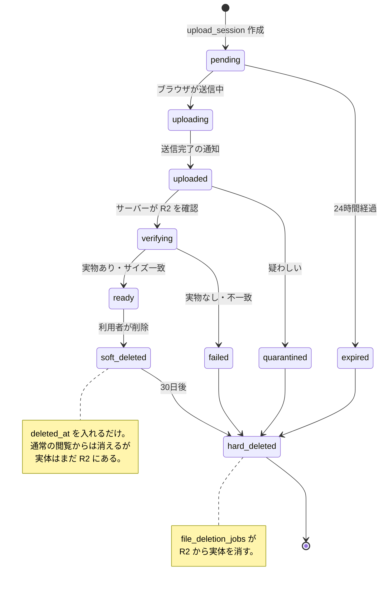

# ファイルの保存

## 1. 原則

- **ファイル本体を PostgreSQL に入れない**
- R2 の Bucket は **Private**。恒久公開 URL を作らない
- **署名付き URL を DB に保存しない**。必要になるたび発行する
- **storage key に氏名を入れない**

## 2. storage key の組み立て

```
teams/<teamId>/<種別>/<年>/<月>/<日>/<uuid>.<拡張子>
```

例:

```
teams/11111111-.../videos/2026/08/12/9f8e7d6c-....mp4
teams/11111111-.../tmp/videos/2026/08/12/9f8e7d6c-....mp4   ← 一時
teams/11111111-.../images/2026/08/12/....jpg
teams/11111111-.../documents/2026/08/12/....pdf
```

### なぜこの形か

| 決めごと                 | 理由                                                                   |
| ------------------------ | ---------------------------------------------------------------------- |
| 氏名を入れない           | key が漏れても誰のものか分からないようにする                           |
| チームで区切る           | 別チームのファイルに手が届かないようにする。key からチームを検算できる |
| 日付で区切る             | 後から棚卸し・整理がしやすい                                           |
| 元のファイル名を使わない | 「山田花子_自主練.mp4」のような名前が保存先に残らない                  |
| 拡張子だけ引き継ぐ       | 許可した拡張子だけ。それ以外は `bin` に倒す                            |

元のファイル名は `files.original_filename` にだけ残します。

### 別チームのファイルを触らせない

署名付き URL を出す前に、key のチームを検算します。

```ts
if (!isKeyOwnedByTeam(key, session.teamId)) {
  // 403
}
```

RLS と合わせて二重に守ります。

## 3. ファイルの一生



| 期間   | 対象                       | 設定                          |
| ------ | -------------------------- | ----------------------------- |
| 24時間 | 一時アップロード（`tmp/`） | `TEMP_UPLOAD_RETENTION_HOURS` |
| 30日   | 論理削除したファイル       | `DELETED_FILE_RETENTION_DAYS` |
| 15分   | 署名付き GET URL           | `SIGNED_URL_EXPIRY_SECONDS`   |

論理削除から30日の猶予があるのは、
**選手が誤って消した動画を取り戻せるようにする**ためです。

## 4. 抽象化

```ts
export interface ObjectStorage {
  createUploadUrl(input: CreateUploadUrlInput): Promise<PresignedUpload>;
  createDownloadUrl(input: CreateDownloadUrlInput): Promise<PresignedDownload>;
  statObject(key: string): Promise<StoredObjectMetadata | null>;
  deleteObject(key: string): Promise<void>;
  objectExists(key: string): Promise<boolean>;
}
```

| 実装                  | 状態                                   |
| --------------------- | -------------------------------------- |
| `CloudflareR2Storage` | ✅ 実装済み（`src/lib/storage/r2.ts`） |
| `S3ObjectStorage`     | ⬜ 将来                                |
| `LocalObjectStorage`  | ⬜ 将来（開発用）                      |

**UI から直接ストレージを触らせません。** 呼ぶのは常にサーバー側です。

R2 が未設定でもアプリは動きます（Phase 7 まで動画投稿を使わないため）。
`getObjectStorage()` を呼んだ時点で初めて例外になります。
設定状況は `/setup-check` で確認できます。

## 5. 受け入れ判定

ブラウザ側の確認は「親切」でしかありません。
**Presigned URL を出す前に、必ずサーバー側で確認します。**

```ts
const result = validateUpload({
  mediaType: 'video',
  mimeType: file.type,
  sizeBytes: file.size,
  durationSeconds: measured,
  todayUploadCount: countFromDb,
});
if (!result.ok) return { error: result.reason };
```

確認する項目:

- 形式（MP4 / MOV / WebM、画像、PDF）
- 容量（種別ごとの上限）
- 長さ（動画のみ）
- その日の投稿本数

## 6. 容量の集計

`storage_usage_snapshots` に日次で記録します（59章）。

| 列                                          | 内容                       |
| ------------------------------------------- | -------------------------- |
| `total_bytes`                               | 合計                       |
| `video_bytes` / `image_bytes` / `pdf_bytes` | 種別ごと                   |
| `temp_bytes`                                | 一時アップロード           |
| `deleted_bytes`                             | 削除待ち（まだ R2 にある） |
| `file_count`                                | ファイル数                 |

警告のしきい値は 70%（注意）/ 85%（警告）/ 95%（緊急）です。

## 7. R2 の設定

```
R2_ACCOUNT_ID=
R2_ACCESS_KEY_ID=
R2_SECRET_ACCESS_KEY=
R2_BUCKET_NAME=
R2_ENDPOINT=https://<accountId>.r2.cloudflarestorage.com
```

Bucket は **Public Access を無効**にしてください。
アクセスキーは、その Bucket にだけ権限を持つものを作ることを勧めます。

### CORS

ブラウザから直接 PUT するため、Bucket 側に CORS の設定が要ります。

```json
[
  {
    "AllowedOrigins": ["https://<本番のドメイン>", "http://localhost:3000"],
    "AllowedMethods": ["PUT", "GET"],
    "AllowedHeaders": ["Content-Type"],
    "ExposeHeaders": ["ETag"],
    "MaxAgeSeconds": 3600
  }
]
```

`AllowedHeaders` に `Content-Type` が無いと、
署名に含めた Content-Type と実際の PUT が食い違って 403 になります。
