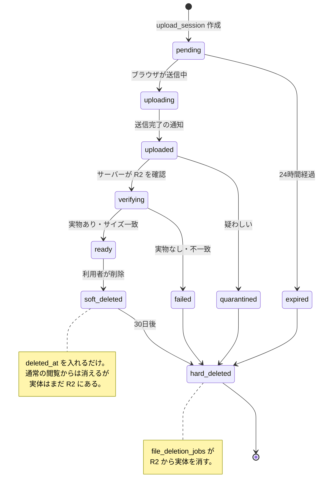
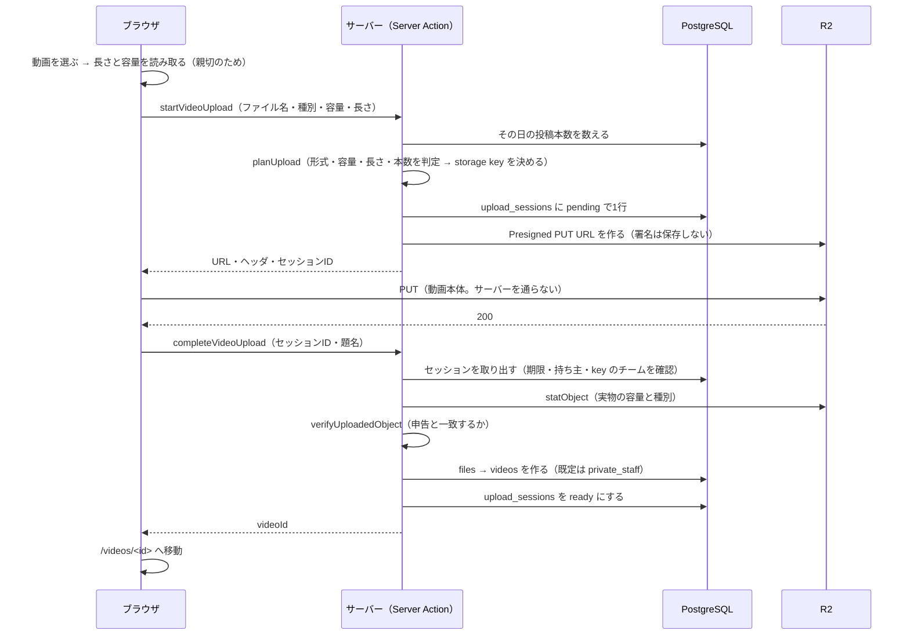

# ファイルの保存

## 1. 原則

- **ファイル本体を PostgreSQL に入れない**
- R2 の Bucket は **Private**。恒久公開 URL を作らない
- **署名付き URL を DB に保存しない**。必要になるたび発行する
- **storage key に氏名を入れない**

## 2. storage key の組み立て

```
teams/<teamId>/<種別>/<年>/<月>/<日>/<uuid>.<拡張子>
```

例:

```
teams/11111111-.../videos/2026/08/12/9f8e7d6c-....mp4
teams/11111111-.../tmp/videos/2026/08/12/9f8e7d6c-....mp4   ← 一時
teams/11111111-.../images/2026/08/12/....jpg
teams/11111111-.../documents/2026/08/12/....pdf
```

### なぜこの形か

| 決めごと                 | 理由                                                                   |
| ------------------------ | ---------------------------------------------------------------------- |
| 氏名を入れない           | key が漏れても誰のものか分からないようにする                           |
| チームで区切る           | 別チームのファイルに手が届かないようにする。key からチームを検算できる |
| 日付で区切る             | 後から棚卸し・整理がしやすい                                           |
| 元のファイル名を使わない | 「山田花子_自主練.mp4」のような名前が保存先に残らない                  |
| 拡張子だけ引き継ぐ       | 許可した拡張子だけ。それ以外は `bin` に倒す                            |

元のファイル名は `files.original_filename` にだけ残します。

### 別チームのファイルを触らせない

署名付き URL を出す前に、key のチームを検算します。

```ts
if (!isKeyOwnedByTeam(key, session.teamId)) {
  // 403
}
```

RLS と合わせて二重に守ります。

## 3. ファイルの一生



| 期間   | 対象                       | 設定                          |
| ------ | -------------------------- | ----------------------------- |
| 24時間 | 一時アップロード（`tmp/`） | `TEMP_UPLOAD_RETENTION_HOURS` |
| 30日   | 論理削除したファイル       | `DELETED_FILE_RETENTION_DAYS` |
| 15分   | 署名付き GET URL           | `SIGNED_URL_EXPIRY_SECONDS`   |

論理削除から30日の猶予があるのは、
**選手が誤って消した動画を取り戻せるようにする**ためです。

### 戻す

「消したもの」（`/trash`）から戻せます。出るのは自分が戻せるものだけです。

| 対象             | 誰が戻せるか                  | 期限                     |
| ---------------- | ----------------------------- | ------------------------ |
| 動画             | 投稿者本人 / `storage.manage` | 実体が消えるまで（30日） |
| 場面             | 作成者本人 / `storage.manage` | なし（元の動画が要る）   |
| トレーニング記録 | 本人だけ                      | なし                     |
| スキルの目標     | `skill.review`                | なし（親が要る）         |

**動画を戻すと、物理削除の予約も取り消します。**
ここを忘れると、戻したはずの動画が30日後に実体だけ消えて、
再生できない動画が残ります。

実体を消したあと（`upload_status = 'deleted'`）は戻せません。
一覧には出しますが、理由を添えて押せないようにしています。

### 誰が実体を消すか

**DB からは R2 を触れません。**
`file_deletion_jobs` は「いつ何を消すか」の予約表でしかなく、
実体を消すのはアプリ側（`runStorageCleanup`）です。

```
/admin/storage で押す
  → 期限の来た予約を取り出す
  → key のチームを検算する（62章）
  → R2 から実体を消す
  → complete_file_deletion() で記録する
     （予約を done に / files に印を付ける / 監査ログに残す）
```

失敗したときも `complete_file_deletion(job, 理由)` を呼びます。
理由を残して `failed` にしておけば、あとで拾い直せます。
黙って消えるのがいちばん困ります。

### 論理削除は関数を通す

`deleted_at` を入れるだけの単純な UPDATE では消せません。

閲覧のポリシーが `deleted_at is null` を条件にしているため、
`deleted_at` を入れた行はそのポリシーを満たさなくなります。
PostgreSQL は UPDATE のときに **更新後の行にも SELECT ポリシーを適用する**ので、
自分で自分を見えなくする更新は弾かれます。

そのため削除は `soft_delete_video` / `soft_delete_video_clip`
（`security definer`、0013）を通します。
関数の中で、順に次を行います。

1. 呼び出した人がその動画を消してよいか確かめる（投稿者本人か、`storage.manage` を持つ人）
2. `videos.deleted_at` と `files.deleted_at` を入れる
3. `audit_logs` に誰が何を消したかを残す
4. `file_deletion_jobs` に30日後の物理削除を予約する

アプリ側からは `supabase.rpc('soft_delete_video', ...)` を呼ぶだけです。
権限確認を関数の中に閉じ込めているので、
`security definer` でも「誰でも消せる」にはなりません。

## 4. 抽象化

```ts
export interface ObjectStorage {
  createUploadUrl(input: CreateUploadUrlInput): Promise<PresignedUpload>;
  createDownloadUrl(input: CreateDownloadUrlInput): Promise<PresignedDownload>;
  statObject(key: string): Promise<StoredObjectMetadata | null>;
  deleteObject(key: string): Promise<void>;
  objectExists(key: string): Promise<boolean>;
}
```

| 実装                  | 状態                                   |
| --------------------- | -------------------------------------- |
| `CloudflareR2Storage` | ✅ 実装済み（`src/lib/storage/r2.ts`） |
| `S3ObjectStorage`     | ⬜ 将来                                |
| `LocalObjectStorage`  | ⬜ 将来（開発用）                      |

**UI から直接ストレージを触らせません。** 呼ぶのは常にサーバー側です。

R2 が未設定でもアプリは動きます。動画の投稿だけが使えません。
`getObjectStorage()` を呼んだ時点で初めて例外になります。
投稿画面は、未設定なら「まだ使えません」と出して `/setup-check` へ案内します。
設定状況は `/setup-check` で確認できます（設定済みかどうかだけを表示し、値は表示しません）。

## 5. 受け入れ判定

ブラウザ側の確認は「親切」でしかありません。
**Presigned URL を出す前に、必ずサーバー側で確認します。**

```ts
const result = validateUpload({
  mediaType: 'video',
  mimeType: file.type,
  sizeBytes: file.size,
  durationSeconds: measured,
  todayUploadCount: countFromDb,
});
if (!result.ok) return { error: result.reason };
```

確認する項目:

- 形式（MP4 / MOV / WebM、画像、PDF）
- 容量（種別ごとの上限）
- 長さ（動画のみ）
- その日の投稿本数

## 6. 実際の投稿の流れ



守っていること:

| 守ること                             | どこで                                          |
| ------------------------------------ | ----------------------------------------------- |
| 動画本体がサーバーを通らない         | ブラウザ → R2 の直接 PUT                        |
| 判定をブラウザに任せない             | `startVideoUpload` が `planUpload` を必ず通す   |
| 1日の本数を申告で数えない            | `upload_sessions` を DB で数える                |
| 「完了した」を信用しない             | `statObject` で実物を見てから `files` を作る    |
| 署名付き URL を DB に保存しない      | 返すだけ。再生用は開くたびに発行する            |
| 別チームの key を掴まされない        | `isKeyOwnedByTeam` を完了時と再生時の両方で通す |
| 投稿した動画がいきなり全体に見えない | `visibility` の既定が `private_staff`           |

再生（`getPlaybackUrl`）は毎回発行します。
期限（既定15分）が切れた状態で再生しようとしたら、
プレイヤーが取り直せるようにしてあります。

## 7. 容量の集計

`storage_usage_snapshots` に日次で記録します（59章）。

| 列                                          | 内容                       |
| ------------------------------------------- | -------------------------- |
| `total_bytes`                               | 合計                       |
| `video_bytes` / `image_bytes` / `pdf_bytes` | 種別ごと                   |
| `temp_bytes`                                | 一時アップロード           |
| `deleted_bytes`                             | 削除待ち（まだ R2 にある） |
| `file_count`                                | ファイル数                 |

警告のしきい値は 70%（注意）/ 85%（警告）/ 95%（緊急）です。

### `upload_status = 'deleted'` の意味

**「R2 から実体が消えた」という意味だけ**に使います。

論理削除しただけの段階では立てません。まだ実体は R2 にあり、容量を使っているからです。
以前は `soft_delete_video` が論理削除の時点で立てており、
そのせいで**アプリから消した動画が容量の集計から外れていました**（0020 で修正）。

## 8. R2 の設定

```
R2_ACCOUNT_ID=
R2_ACCESS_KEY_ID=
R2_SECRET_ACCESS_KEY=
R2_BUCKET_NAME=
R2_ENDPOINT=https://<accountId>.r2.cloudflarestorage.com
```

Bucket は **Public Access を無効**にしてください。
アクセスキーは、その Bucket にだけ権限を持つものを作ることを勧めます。

### CORS

ブラウザから直接 PUT するため、Bucket 側に CORS の設定が要ります。

```json
[
  {
    "AllowedOrigins": ["https://<本番のドメイン>", "http://localhost:3000"],
    "AllowedMethods": ["PUT", "GET"],
    "AllowedHeaders": ["Content-Type"],
    "ExposeHeaders": ["ETag"],
    "MaxAgeSeconds": 3600
  }
]
```

`AllowedHeaders` に `Content-Type` が無いと、
署名に含めた Content-Type と実際の PUT が食い違って 403 になります。
