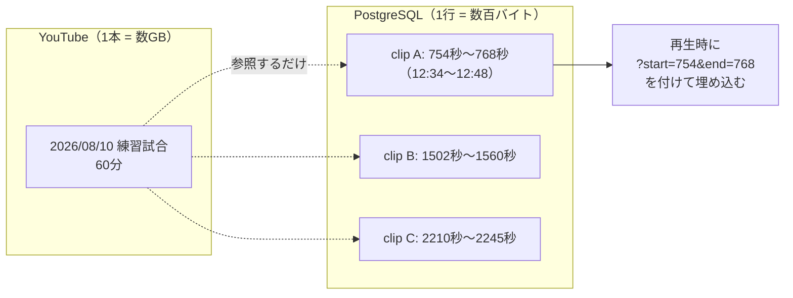
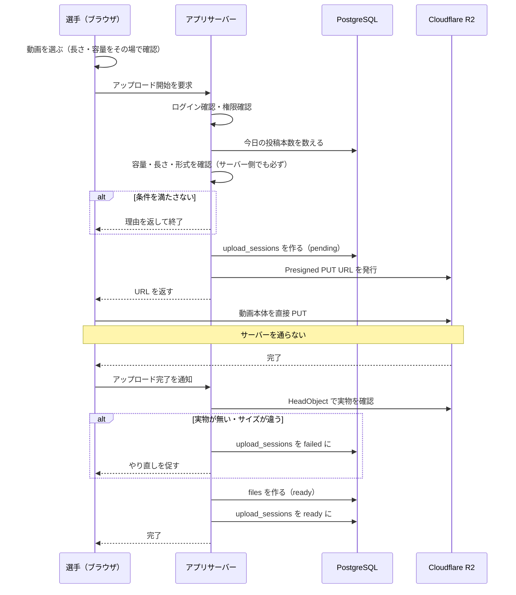
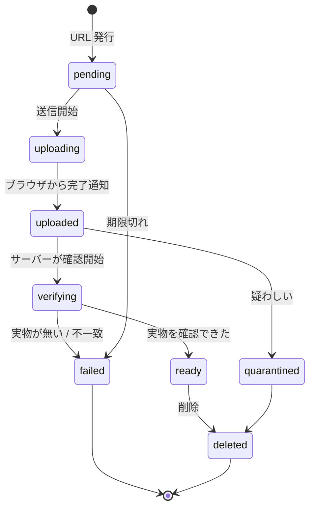
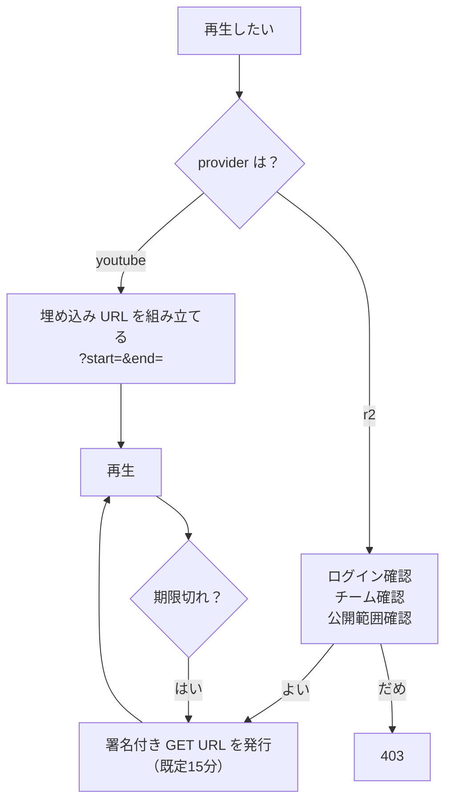
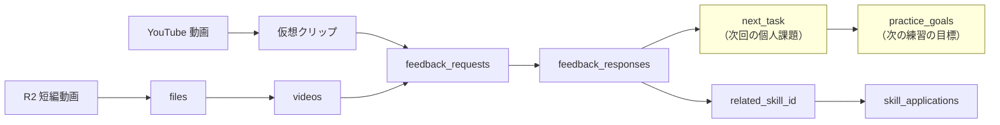

# 動画の設計

## 1. 動画を3種類に分ける

容量を抑えつつ、選手が気軽に質問できるようにするための分け方です（18章）。

| 種類            | 例                             | 置き場所               | アプリが持つもの     |
| --------------- | ------------------------------ | ---------------------- | -------------------- |
| A. 長時間動画   | 試合全体、練習全体             | YouTube 限定公開       | 動画IDと長さだけ     |
| B. 仮想クリップ | 「12:34〜12:48 を見てほしい」  | **どこにも保存しない** | 開始秒と終了秒       |
| C. 短編動画     | スマホで切り抜いた動画、自主練 | Cloudflare R2          | ファイルのメタデータ |

## 2. 仮想クリップ（B）

**実ファイルを切り出しません。** これが容量対策の中心です。



100個のクリップを作っても、増えるのは DB の100行だけです。
動画は1本のままです。

`video_clips` が持つのはこれだけです。

```
video_id / start_seconds / end_seconds / created_by / title / description
```

### 守っていること

- `start_seconds >= 0`（CHECK 制約）
- `end_seconds > start_seconds`（CHECK 制約）
- `end_seconds <= 元動画の長さ`（トリガ `app.validate_video_clip()`）
- 切り出す範囲が長すぎない（既定300秒。`validateClipRange()`）

CHECK 制約では他のテーブルを見られないため、長さの確認はトリガで行っています。

## 3. 短編動画の投稿（C）

動画本体をアプリサーバーに通しません（20章）。



### なぜ完了後に確認するのか

Presigned URL を出した時点では、実際に上がったかどうか分かりません。
ブラウザが「完了した」と言ってきても、それは信用できません。
**サーバーが R2 に問い合わせて実物を確認してから** `files` を確定させます。

### upload_sessions の状態（21章）



一時アップロードは24時間で消せるよう、
`teams/<teamId>/tmp/...` という別の場所に置きます。

## 4. 制限（19章）

| 項目        | 既定             | 環境変数                           |
| ----------- | ---------------- | ---------------------------------- |
| 最大の長さ  | 60秒             | `MAX_VIDEO_DURATION_SECONDS`       |
| 推奨の長さ  | 15〜30秒         | —                                  |
| 最大容量    | 50MB             | `MAX_VIDEO_SIZE_BYTES`             |
| 1依頼あたり | 1本              | —                                  |
| 1日あたり   | 5本              | `MAX_DAILY_VIDEO_UPLOADS_PER_USER` |
| 形式        | MP4 / MOV / WebM | —                                  |

推奨は MP4 / H.264 / AAC / 1080p以下 / 30fps です。

断るときは、利用者がその場で直せる言葉で返します。

> 動画が長すぎます（上限 60秒、選択されたもの 90秒）。
> 見てもらいたい場面だけを切り出してください。

## 5. 再生



- R2 の Bucket は Private。恒久公開 URL は作りません
- 署名付き URL は**DB に保存しません**。必要になるたび発行します
- 期限が切れたら取り直せます

## 6. 抽象化

```ts
export interface VideoProvider {
  getMetadata(input: VideoReference): Promise<VideoMetadata>;
  createPlaybackSource(input: PlaybackRequest): Promise<PlaybackSource>;
  supportsVirtualClip(): boolean;
}
```

| 実装                            | 状態        |
| ------------------------------- | ----------- |
| `YouTubeVideoProvider`          | ✅ 実装済み |
| `R2VideoProvider`               | ⬜ 将来     |
| `CloudflareStreamVideoProvider` | ⬜ 将来     |

R2 の短編動画は、この抽象を通していません。
`getPlaybackUrl`（Server Action）が `ObjectStorage` から署名付き URL を出し、
`<video>` に渡すだけで足りるためです。
仮想クリップのように「提供元ごとに再生の作り方が違う」場面が出てきたら、
そのときに `R2VideoProvider` に寄せます。

MVP では YouTube Data API を呼びません（外部依存を増やさないため）。
動画の長さは登録時に人が入力します。API を足す場合はこのクラスだけを差し替えます。

### YouTube の URL 解析

貼り付けられた URL から動画IDを取り出します。対応する形は次の通りです。

```
https://www.youtube.com/watch?v=ID
https://youtu.be/ID
https://www.youtube.com/embed/ID
https://www.youtube.com/live/ID
https://www.youtube.com/shorts/ID
ID（11文字そのまま）
```

## 7. フィードバックとのつながり



回答の `next_task` が次の練習の `practice_goals` になり、
`related_skill_id` がスキル申請につながります。
これが「フィードバックが次の練習課題につながる」の実装です。

## 8. 作らないもの（76章）

MVP では次を作りません。ただし将来足せる形にしています。

AI 動画分析 / 自動選手追跡 / 動画への自由描画 / 自動ハイライト /
自動字幕 / FFmpeg の同期処理 / Cloudflare Stream / YouTube 自動コメント
