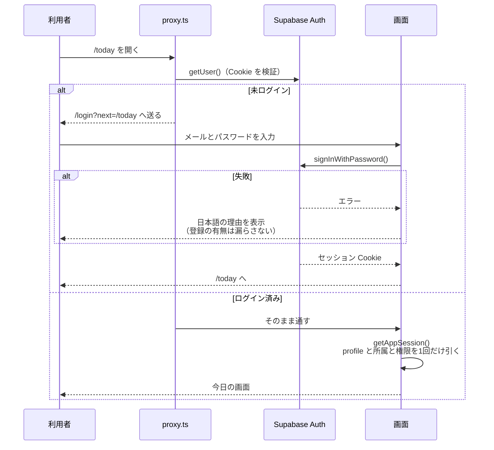
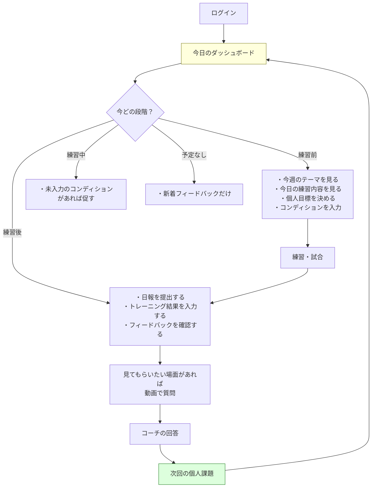
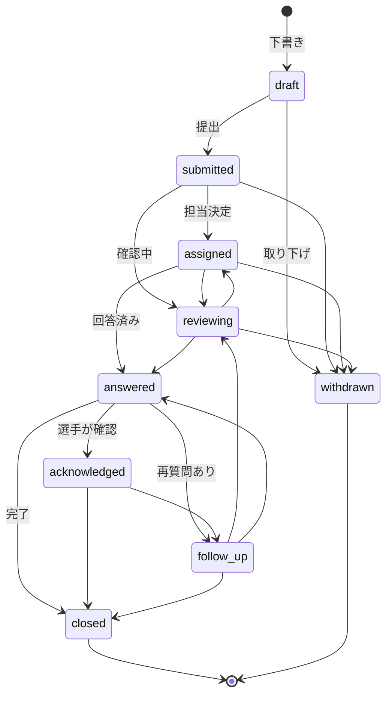
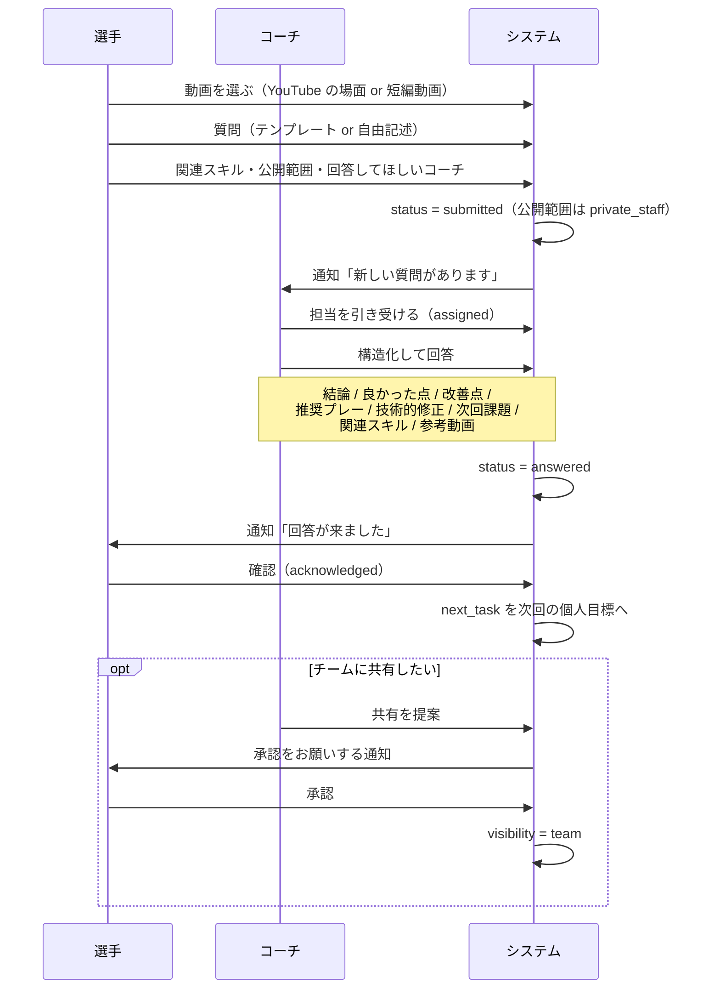
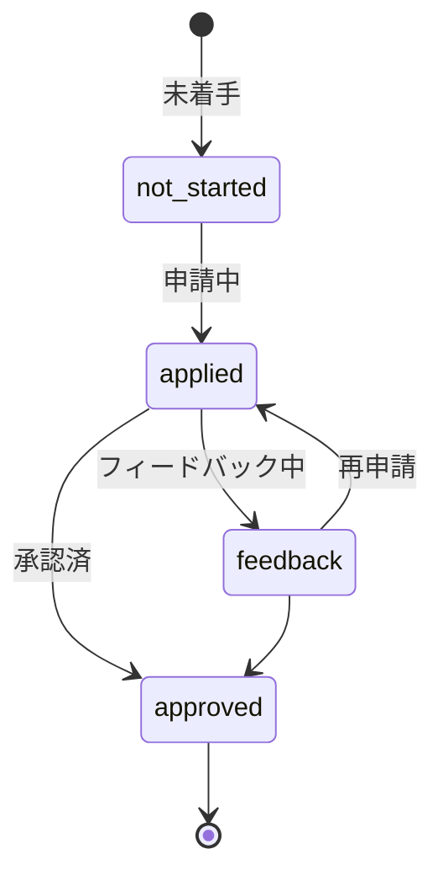
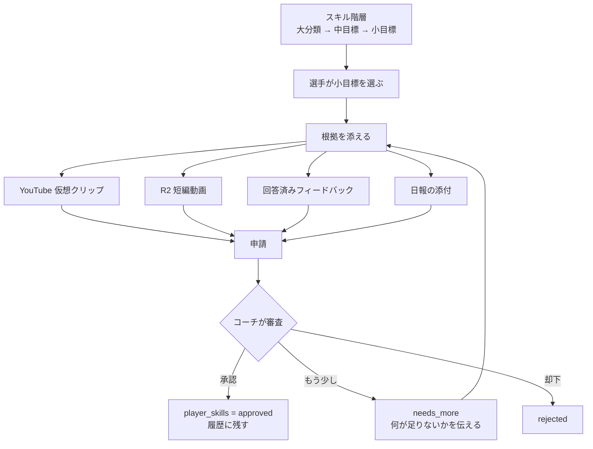
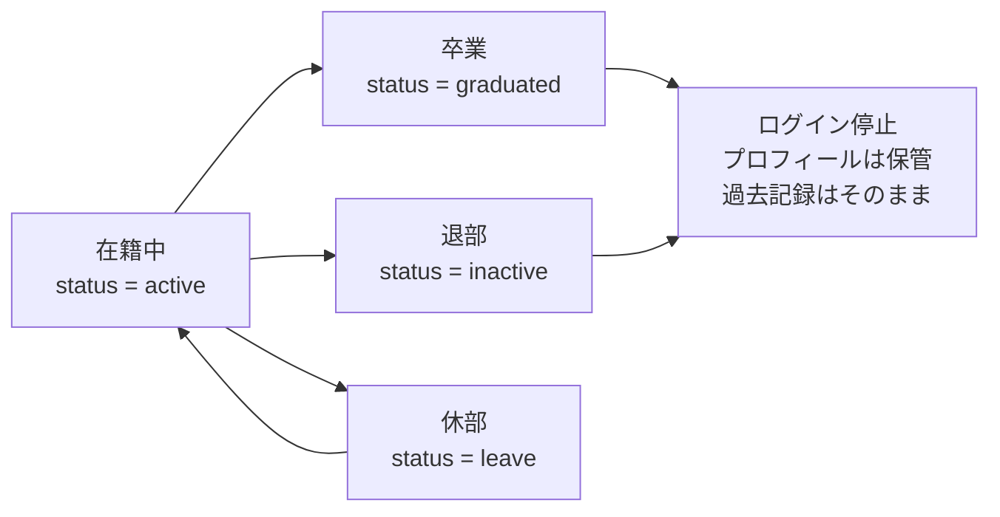

# 主な流れ

## 1. ログイン

`getSession()` は Cookie の中身をそのまま信じるため、サーバー側では使いません。
必ず `getUser()` の結果を使います。

## 2. 1日の流れ

システムの中心です。選手が「今日何をすればいいか」で迷わないようにします。

段階の判定は `src/features/dashboard/lib/pending-actions.ts` にあります。

- 練習前に日報を求めない
- オフやミーティングの日には記録を求めない
- 時刻が入っていないイベントは「練習前」として扱う（入力を妨げない）
- 全部終わったら「今日やることは全部終わりました」と伝える

## 3. 動画フィードバック

**この図にない遷移はデータベースが拒否します。**
`app.guard_feedback_status()` トリガが、
不正な遷移で例外を投げ、正しい遷移では履歴を自動的に残します。

### 質問から次回課題まで

**コーチが一方的にチーム公開へ変えることはできません。**
必ず選手の承認を経ます。

回答は**上書きしません**。`feedback_responses` に追記していきます。
3日以上回答が無いものはコーチのダッシュボードに出ます。

## 4. スキル承認

コーチの回答から `related_skill_id` を指定できるので、
「この動画をスキル申請に使えますか」という質問から
そのまま申請につなげられます。

## 5. データ移行

[docs/import.md](import.md) を参照してください。

## 6. ファイルの一生

[docs/storage.md](storage.md) を参照してください。

## 7. 卒業・退部（61章）

**利用者の削除と過去記録の削除を直接つなげません。**
日報もフィードバックもスキル履歴も、その人が積み上げたものとして残します。
名簿では既定で在籍中だけを表示し、「卒業・退部も含めて表示」で切り替えます。
