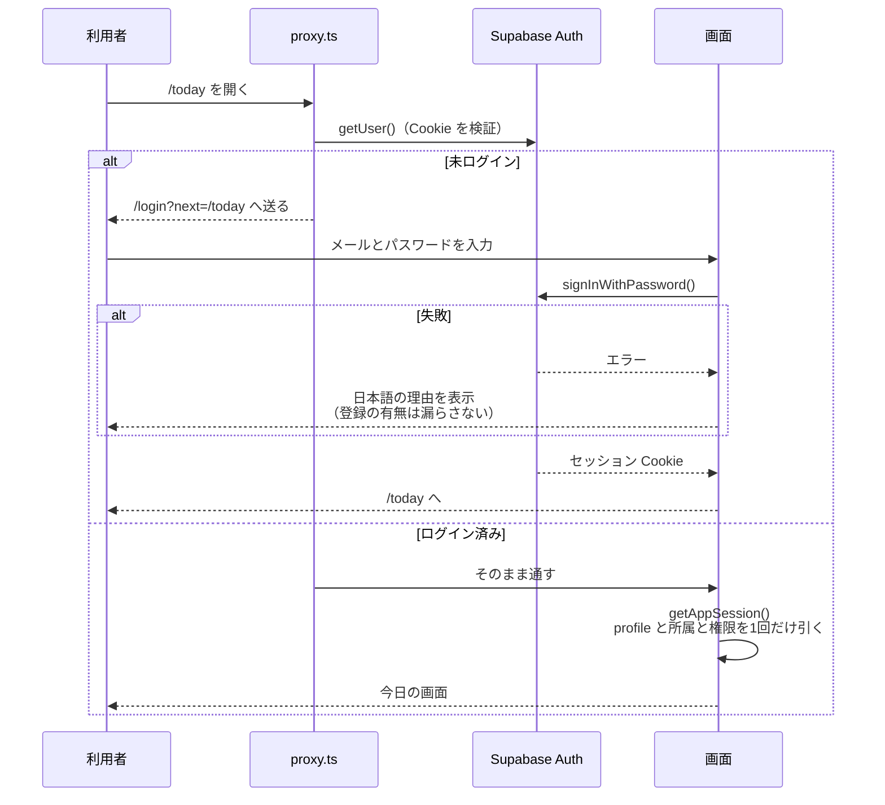
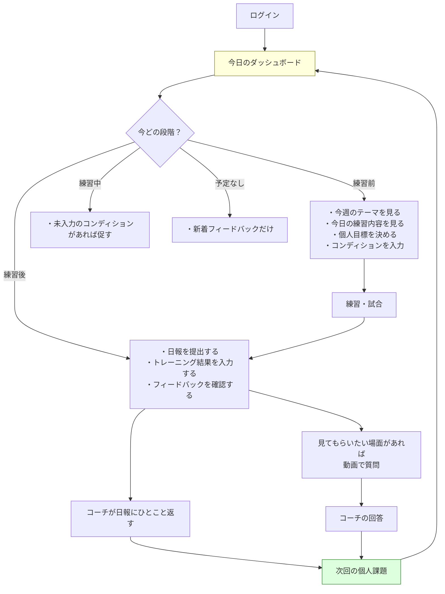
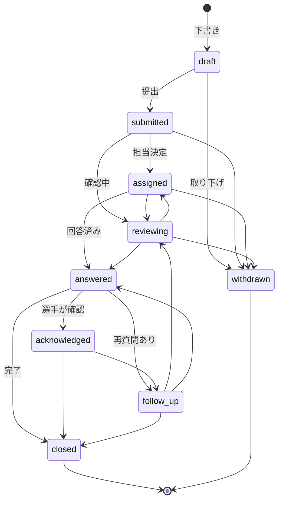
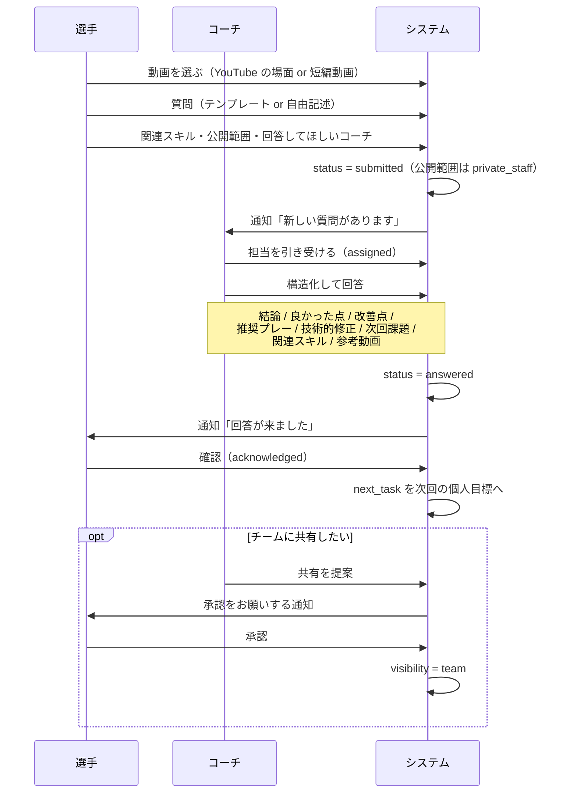
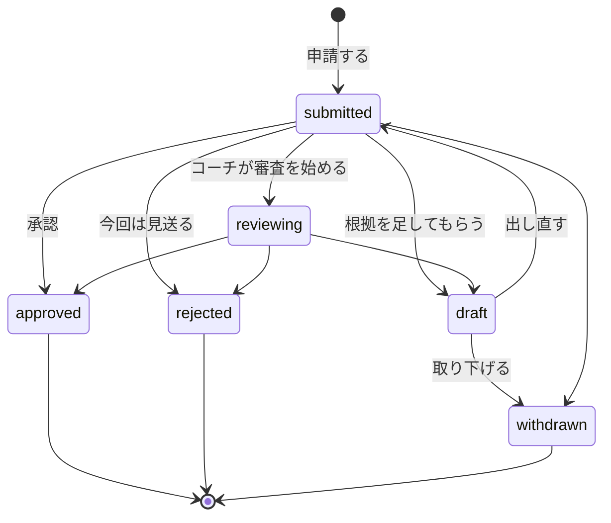
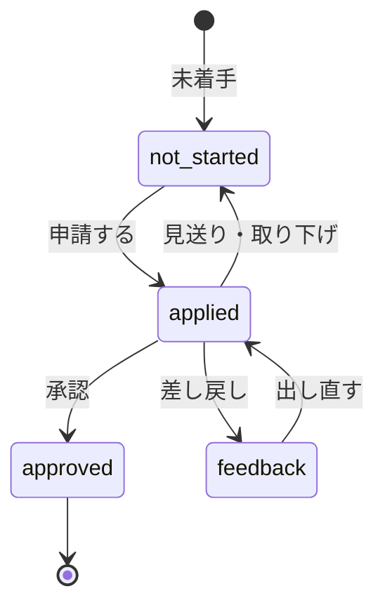
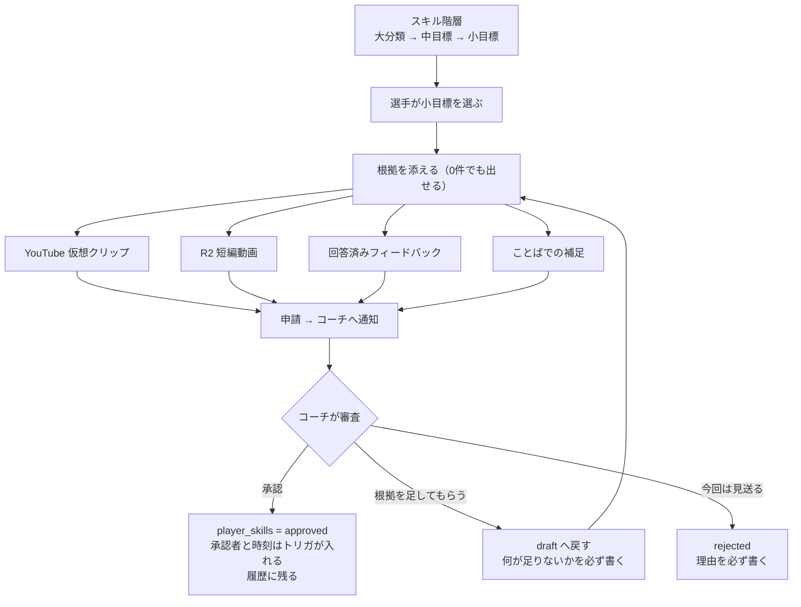
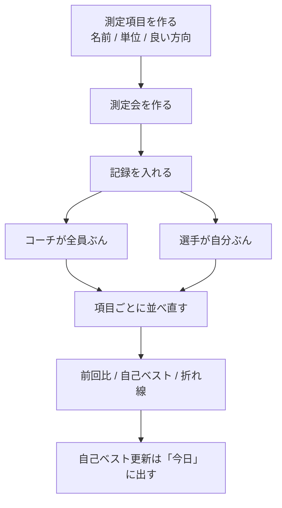
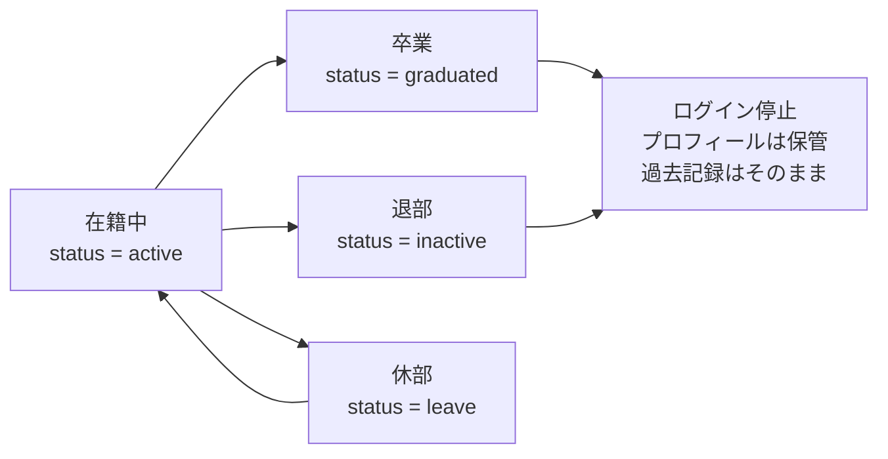

# 主な流れ

## 1. ログイン



`getSession()` は Cookie の中身をそのまま信じるため、サーバー側では使いません。
必ず `getUser()` の結果を使います。

## 2. 1日の流れ

システムの中心です。選手が「今日何をすればいいか」で迷わないようにします。



段階の判定は `src/features/dashboard/lib/pending-actions.ts` にあります。

- 練習前に日報を求めない
- オフやミーティングの日には記録を求めない
- 時刻が入っていないイベントは「練習前」として扱う（入力を妨げない）
- 全部終わったら「今日やることは全部終わりました」と伝える

### 日報へのコーチのコメント（16章）

動画を撮って質問するほどではない日のための、短い往復です。
毎日回るのはこちらで、動画の質問（3節）は「ここぞ」のとき用です。

```
選手: 日報を出す（公開範囲の既定は「コーチまで」）
コーチ: 今日 → 未コメントの件数 → 提出状況 → 日報を開く → ひとこと返す
選手: 通知 → 自分の日報でコメントを読む → 次の目標にする
```

| 決めごと                             | 理由                                           |
| ------------------------------------ | ---------------------------------------------- |
| 「自分だけ」の日報にはコメントしない | 公開範囲は選手の意思表示。権限では越えない     |
| 上書きせず、届いた順に残す           | やり取りの流れが読めるようにする（55章と同じ） |
| 消せるのは書いた本人だけ             | 読んだかもしれないものが、他人の判断で消えない |
| 未コメントのものを上に並べる         | 返事の抜けを減らす（3章の4）                   |
| 空のコメントは出せない               | 空欄は選手には「無言の既読」に見える           |

公開範囲を後から狭めると、すでに書かれたコメントも一緒に見えなくなります
（`app.can_see_report()`。[security.md](security.md) 15節）。

### 「出したこと」と「中身」を分ける

公開範囲は**中身**にだけ効きます。出したという事実は、公開範囲によらず伝わります。

| 公開範囲   | 出したこと | 中身             | コメント |
| ---------- | ---------- | ---------------- | -------- |
| 自分だけ   | 伝わる     | 誰にも見せない   | 付かない |
| コーチまで | 伝わる     | コーチとスタッフ | 付く     |
| チーム全員 | 伝わる     | 部員全員         | 付く     |

そうしないと、「自分だけ」で出した選手が提出状況で**未提出**として並びます。
見落としを減らすための画面が、出した人を責める形になってしまいます。

この扱いは選手に隠しません。公開範囲を選ぶその場に、
そのとき何が伝わるかを出しています（`disclosure.ts`）。
コーチ側では鍵の印で「出したが中身は本人だけ」を表します。

なぜ関数を通しているかは [security.md](security.md) 16節にあります。

## 3. 動画フィードバック



**この図にない遷移はデータベースが拒否します。**
`app.guard_feedback_status()` トリガが、
不正な遷移で例外を投げ、正しい遷移では履歴を自動的に残します。

### 質問から次回課題まで



**コーチが一方的にチーム公開へ変えることはできません。**
必ず選手の承認を経ます。

回答は**上書きしません**。`feedback_responses` に追記していきます。
3日以上回答が無いものはコーチのダッシュボードに出ます。

## 4. スキル承認

2つの状態が動きます。混同しないように分けて書きます。

| 対象                        | 何を表すか                             | 数              |
| --------------------------- | -------------------------------------- | --------------- |
| `skill_applications.status` | その「申請」がいまどこにあるか         | 何度でも出せる  |
| `player_skills.status`      | その選手がそのスキルにどこまで届いたか | スキルごとに1つ |

### 申請の状態



**差し戻し（`needs_more`）は不合格ではありません。**
申請は選手の手元（`draft`）へ戻り、根拠を足して出し直せます。
一度も出していない下書きと見分けるため、
画面では「審査の記録があるか」で「差し戻し」と表示を変えています。

### 到達状況の動き

申請を動かすと、到達状況も対で動きます。
対応表は `features/skills/lib/state.ts` の1か所に置いてあります。



`approved` からは戻しません。
一度「できる」と言われたものが黙って消えると、選手は記録を信じなくなります。
誤って承認した場合は、審査担当だけが理由を添えて直せます（0014）。

### 全体の流れ



守っていること:

| 守ること                           | どこで                                       |
| ---------------------------------- | -------------------------------------------- |
| 自分で自分を承認できない           | `app.validate_player_skill()` トリガ（0014） |
| 審査担当が自分の申請を審査できない | 本人であることを優先して立場を決める         |
| 差し戻し・見送りには理由が要る     | Server Action で確認                         |
| 他人の動画・質問を根拠にできない   | 候補は自分のものだけ + トリガ（0014）        |
| 承認者と時刻を詐称できない         | トリガが入れる。アプリからは書かせない       |
| 履歴を書き換えられない             | `skill_status_histories` の権限を剥がす      |

コーチの回答から `related_skill_id` を指定できるので、
「この動画をスキル申請に使えますか」という質問から
そのまま申請につなげられます。
回答画面に「この回答を根拠にスキルを申請する」が出ます。

### 進捗の数え方

**数えるのは小目標（末端）だけです。**
中目標は小目標の入れ物なので、一緒に数えると
「中目標を承認しただけで進捗が跳ねる」ことになります。
子を持たない中目標は、それ自体が到達点なので数えます。

## 5. 測定（3章の6）



**良い方向を項目ごとに持ちます**（`measurement_items.better`）。

| 項目の例   | better   | 良くなったとは |
| ---------- | -------- | -------------- |
| 50m走      | `lower`  | 値が減ること   |
| YoYoテスト | `higher` | 値が増えること |
| 反復横跳び | `higher` | 値が増えること |

ここを間違えると、速くなったのに「落ちた」と表示されます。
比較・自己ベスト・折れ線の上下、すべてこの値で切り替えています。
**折れ線は常に、良い方向が上**になります。

### 空欄と 0 は違う

空欄は「測っていない」、0 は「0だった」。
空欄で送られたら記録を消し、0 は記録として残します。

### 誰が入れられるか

| 立場     | できること                                  |
| -------- | ------------------------------------------- |
| スタッフ | 測定会と項目を作る / 全員ぶんの記録を入れる |
| 選手     | 自分の記録を入れる / 自分の推移を見る       |

他人の記録は見えませんし、触れません（RLS + 0017 のトリガ）。

## 6. データ移行

[docs/import.md](import.md) を参照してください。

## 7. ファイルの一生

[docs/storage.md](storage.md) を参照してください。

## 8. 卒業・退部（61章）



**利用者の削除と過去記録の削除を直接つなげません。**
日報もフィードバックもスキル履歴も、その人が積み上げたものとして残します。
名簿では既定で在籍中だけを表示し、「卒業・退部も含めて表示」で切り替えます。
